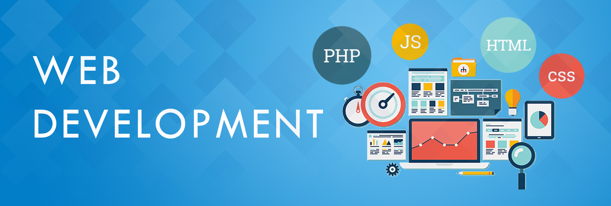

  

<h1 align="center">Hi 👋, I'm Awais Khan</h1>

<h3 align="center">A Passionate WordPress & Frontend Developer from Pakistan 🇵🇰</h3>

  

---

### 👨‍💻 About Me

- 🔧 I specialize in **WordPress development**, including custom themes, plugins, and WooCommerce customization.
- 🧠 I'm passionate about clean code, optimized performance, and responsive UI/UX.
- 🌱 Currently exploring more on **Headless WordPress**, **React**, and **Gutenberg Block Development**.
- 🛠️ Tools I work with daily: WordPress, ACF, Elementor, JavaScript, Tailwind, PHP.
- ✍️ I regularly build client websites that convert and perform well.
- 🎯 Goal for 2025: Contribute to open-source and build my own WordPress plugin.

---

### 🛠️ Tech Stack

  
  &nbsp;&nbsp;&nbsp;&nbsp;&nbsp;&nbsp;&nbsp;&nbsp;&nbsp;
  
  &nbsp;&nbsp;&nbsp;&nbsp;&nbsp;&nbsp;&nbsp;&nbsp;&nbsp;
  
  &nbsp;&nbsp;&nbsp;&nbsp;&nbsp;&nbsp;&nbsp;&nbsp;&nbsp;
  
  &nbsp;&nbsp;&nbsp;&nbsp;&nbsp;&nbsp;&nbsp;&nbsp;&nbsp;
  
  &nbsp;&nbsp;&nbsp;&nbsp;&nbsp;&nbsp;&nbsp;&nbsp;&nbsp;
  
  &nbsp;&nbsp;&nbsp;&nbsp;&nbsp;&nbsp;&nbsp;&nbsp;&nbsp;
  
  &nbsp;&nbsp;&nbsp;&nbsp;&nbsp;&nbsp;&nbsp;&nbsp;&nbsp;
  
  &nbsp;&nbsp;&nbsp;&nbsp;&nbsp;&nbsp;&nbsp;&nbsp;&nbsp;
  
  &nbsp;&nbsp;&nbsp;&nbsp;&nbsp;&nbsp;&nbsp;&nbsp;&nbsp;
  

---

### 🧰 Tools & Platforms

- 🧩 WordPress, WooCommerce, ACF, Elementor  
- 🎨 Figma, Adobe XD (for UI design collaboration)  
- 💻 LocalWP, XAMPP, cPanel  
- 🛠️ Git, GitHub, FTP, phpMyAdmin  
- 🔍 SEO optimization & performance tuning  

---

### 📊 GitHub Stats

  
  &nbsp;&nbsp;&nbsp;&nbsp;&nbsp;&nbsp;&nbsp;&nbsp;&nbsp;
  

  
  

---

### 🚀 Highlight Projects

- 🖥️ **Custom WooCommerce Quote Builder** — Built a request system for B2B clients using AJAX + ACF  
- 📦 **Elementor Portfolio Theme** — Lightweight, fast-loading portfolio for creatives  
- 🔐 **Membership Site with Paywall** — WordPress + Restrict Content Pro integration  
- 🔄 **Data Sync with External APIs** — Integrated WordPress with CRM system using REST API

---

### 📫 Let's Connect

- 🌐 [Portfolio Website](#) — *(Add your portfolio URL here)*  
- 💼 [LinkedIn](https://www.linkedin.com/in/awais-khan-487203308/)  
- 📧 Email: awaiskhan.raees123@gmail.com

---

✨ Thanks for visiting my GitHub! ✨

